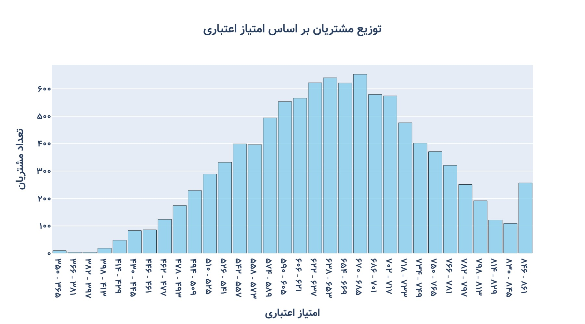
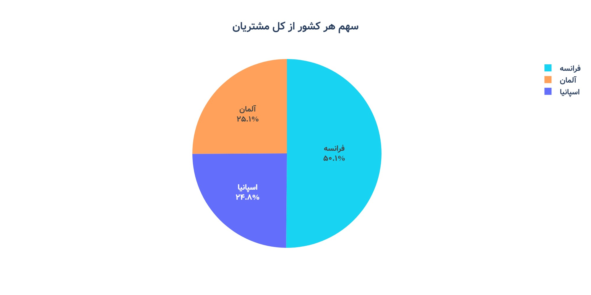
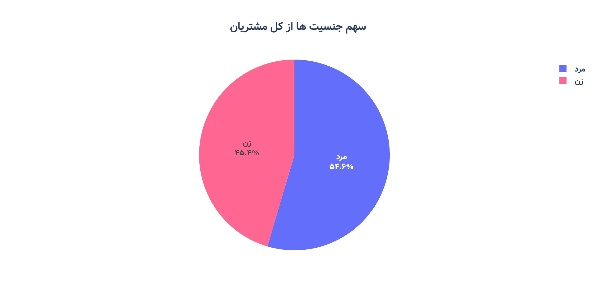
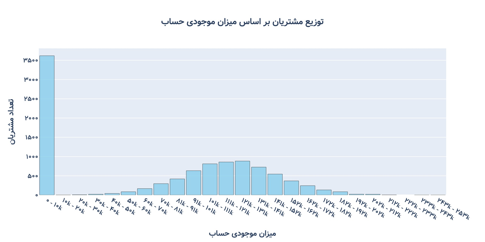
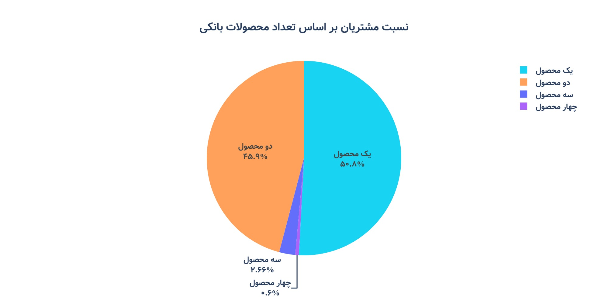
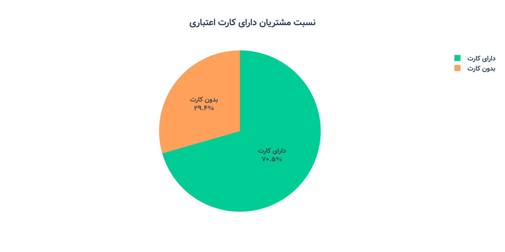
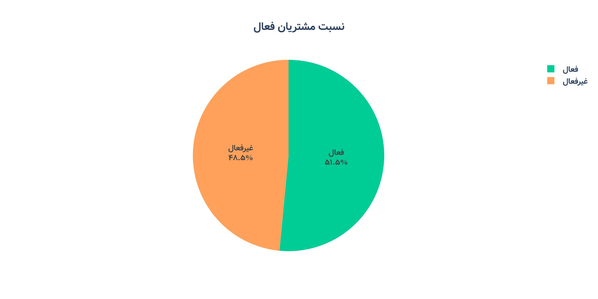
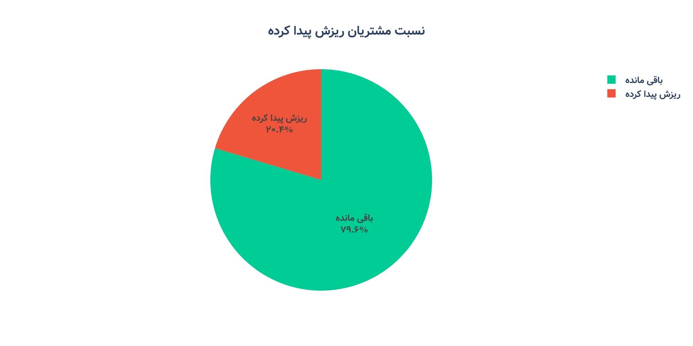

# تحلیل داده های ریزش مشتریان بانکی

این پروژه یک تحلیل داده‌های مشتریان بانک با استفاده از پایتون است که بر شناسایی الگوهای ترک مشتریان تمرکز دارد. داده‌ها در قالب CSV ارائه شده و نیازی به پاک‌سازی ندارند، بنابراین تمرکز پروژه بر تحلیل اکتشافی داده‌ها (EDA) و استخراج بینش‌های کلیدی است.

**ویژگی‌های اصلی پروژه:**  

• استفاده از پایتون برای تحلیل داده و مصورسازی نتایج  
• بررسی روندها و الگوهای رفتاری مشتریان  
• مناسب برای نمونه‌کار در رزومه و نشان دادن توانمندی‌های تحلیلی

**مشخصات داده:**
 
• فایل CSV مورد نظر دارای 13 ستون و 10 هزار ردیف می باشد.  
• فایل با نام Bank_Churn_Data_Dictionary مربوط به توضیحات هر کدام از ستون ها می باشد.  

**تمرکز این پروژ بر یافتن علت ریزش مشتریان بانکی می باشد، به همین منظور ارتباط بین ستون ریزش و ستون های دیگر به طور جدی مورد بررسی خواهد گرفت.** 

**برخی از سوالات مهم که تا انتهای تحلیل به آنها پاسخ داده ته خواهد شد:**  

• کدام کشور بیشترین سهم از مشتریان را دارد؟  
• در کدام کشور بیشترین میزان ریزش مشتری وجود دارد؟  
• چند درصد از مشتریان دارای موجودی حساب صفر ریزش پیدا کرده اند و یا غیر فعال می باشند؟  

این پروژه به علاقه‌مندان داده کمک می‌کند تا فرآیند تحلیل داده‌های واقعی (برای تمرین) و تکنیک‌های پایه تحلیل داده با پایتون را مشاهده کنند.

---
# ‼️‼️‼️این پروژه در حال برزورسانی می باشد و تا کنون بخش ابتدایی آن کامل شده است‼️‼️‼️

## دید کلی داده ها با استفاده از نمودار

### هیستوگرام توزیع مشتریان بر اساس امتیاز اعتباری 

توزیع مشتریان بر اساس امتیاز اعتباری، یک نوع توزیع نرمال می باشد.

نکته جالب این است که آخرین بازه (یعنی 861 - 846) دارای مشتریان بیشتری نسبت به 3 بازه قبلی خود دارد.

---

### سهم هر کشور از کل مشتریان

 کشور فرانسه بیشترین سهم از مشتریان بانکی را دارا می باشد. به عبارت دیگر با توجه به تعداد 10 هزار نفری مشتریان بانکی، حدود 5 هزار نفر از مشتریان اهل کشور فرانسه می باشند.

---

### سهم جنسیت ها از کل مشتریان

بیشتر مشتریان بانکی را مردان تشکیل می دهند، البته اختلاف بین مردان و زنان کم بوده و این اختلاف حدود 9 درصد (900 مشتری) می باشد.

---

### توزیع مشتریان بر اساس سن

توزیع مشتریان بر اساس سن، یک نوع توزیع نرمال (با چولگی مثبت) می باشد.

بیشتر مشتریان در بازه سنی حدودی 30 تا 40 سال قرار دارند.

مشتریان با سن بیشتر از 60 سال به نسبت دیگر مشتریان تعداد بسیار کمتری دارند.

💡💡💡 **در مورد جمعیت بالاتر ار 60 سال پیشنهاد می شود که که بانک با در نظر گرفتن همه جوانب، طرح های تشویقی مانند وام های کم بهره برای این گروه در نظر بگیرد و همچنین خدمات بانکی خود مانند تجربه کاربری نرم افزار های .کاربردی خود را برای این گروه بهینه کند.**

---

### توزیع مشتریان بر اساس تعداد سال های عضویت مشتری

 توزیع مشتریان بر اساس تعداد سال های عضویت، یک نوع توزیع ذوزنقه ای می باشد.

---

### توزیع مشتریان بر اساس میزان موجودی حساب

 توزیع مشتریان بر اساس میزان موجودی حساب بدون در نظر گرفتن بازه 0 تا 10 هزار، یک نوع توزیع نرمال می باشد.

 حدود 3600 نفر از مشتریان دارای موجودی حساب کمتر از 10 هزار می باشند.

❓❓❓ سوالی که در انجا مطرح می شود این است که چه تعداد از ای 3600 نفر دارای موجودی حساب دقیقا صفر می باشند.

---

### نسبت مشتریان بر اساس تعداد محصولات بانکی

حدود 50 درصد از مشتریان فقط از یک از محصولات بانکی استفاده کرده اند و همچنین 3 درصد از مشتریان از 3 یا 4 محصول بانک استفاده کرده اند.

💡💡💡 **با توجه به نمودار بالا و عدم وجود داده در مورد انواع محصولات بانک پیشنهاد می شود که که بانک با در نظر گرفتن همه جوانب، ابتدا بررسی کند که محصولات دارای متقاضی کمتر از نوع محصولات ضروری می باشند یا غیر ضروری. اگر محصولات دارای متقاضی کم از نوع ضروری بوده اند، پس باید بررسی شد که به چه علت مشتریان تقاضای بسیار کمی داشته اند و اگر این محصولات از نوع غیر ضروری بوده اند بهتر است از مجموعه خدمات بانک حذف شوند تا از مخارج بانک کاسته شود.**

---

### نسبت مشتریان دارای کارت اعتباری

حدود 70 درصد از مشتریان دارای کارت بانکی می باشند.

---

### نسبت مشتریان فعال

حدود 51.5 درصد از مشتریان فعال بوده اند، در ادامه بررسی خواهد شد که آیا این آمار پایین به جمعیت افراد ریزش پیدا کرده مربوط است یا نه.

 🧪🧪🧪 فرضیه ای در اینجا مطرح می شود که به دلیل اینکه اکثریت افراد ریزش پیدا کرده جز افراد غیر فعال هستند درصد افراد غیر فعال به نسبت افراد غیر فعال افزایش پیده کرده، بنببراین در ادامه نمودار های بیشتری برای بررسی این فرضه ارائه خواهد شد 

---

### نسبت مشتریان ریزش پیدا کرده

حدود 20 درصد از مشتریان ریزش پیدا کرده اند، بنابراین با توجه به جمعیت 10 هزار نفری مشتریان، حدود 2 هزار نفر ریزش پیدا کرده اند.

